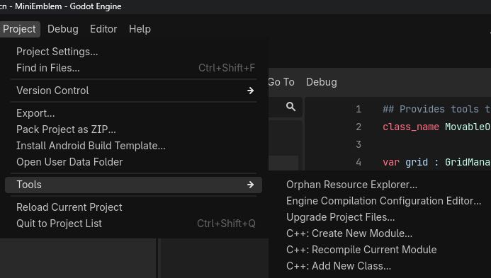

# Godot Cpp Wizard for Godot 4.x+
This plugin aims to replicate the UX of developping in Unreal with Cpp.
This is very experimental and will scale with time, for now I just aim to add basic things such as adding a GDExtension module and classes

The project contains on the `main` branch the entire project environment and the plugin itself, another branch `release` will contain the addons only and you can still download the plugin only in the release section.

# Installation

## Requirements
- A Godot 4.x minimum
- Python installed
- Scons instamlled
- A C++ compiler (MSVC, Clang)

## Install the plugin
Download latest version of the plugin and place it in `res://addons/` root.
go in Project Settings > Plugins and activate the plugin

## Using the plugin
I tried integrating my plugin inside [Mini Emblem](https://github.com/EliottChen/MiniEmblem) as a test case.
If you see theses three options appearing in Project > Tools, then the plugin has been installed succesfully!

# Advanced infos
By default the plugin has the godot-cpp header files in the plugin directly, there is no way to specify a custom path for now this is a known limitation.

# Known issues: 
You can't switch modules for now, and if you create a second module you won't be able to add class to the previous module.
To delete module:
- Delete bin and module folder in `res://` 